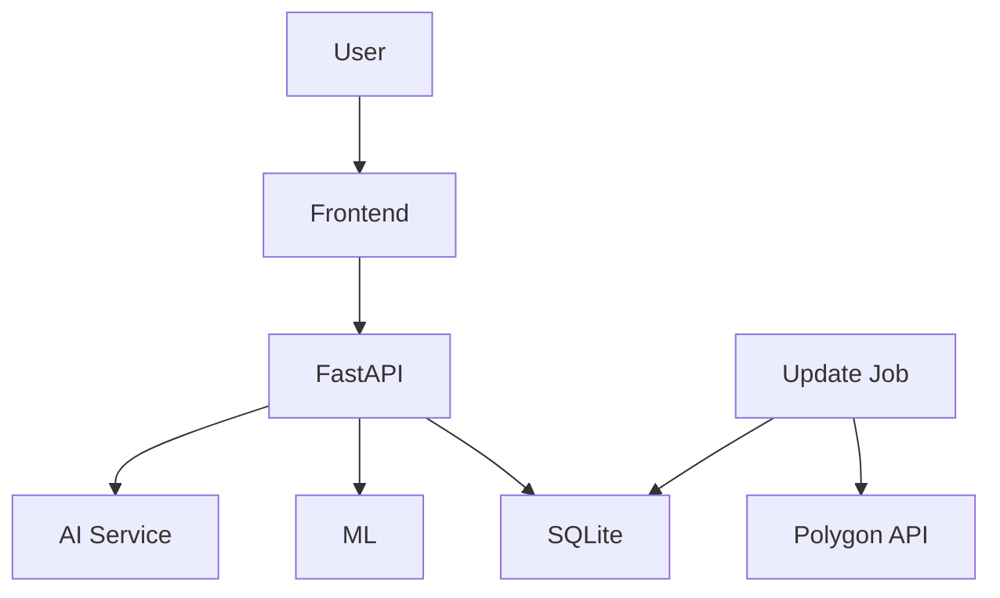
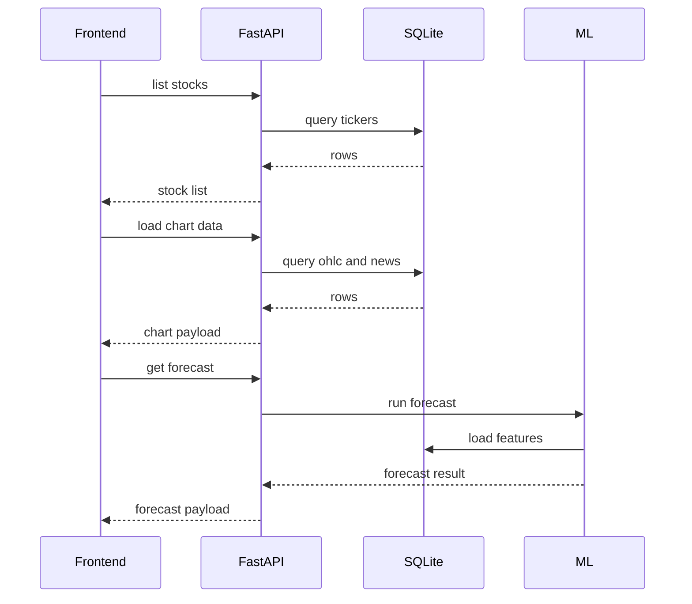
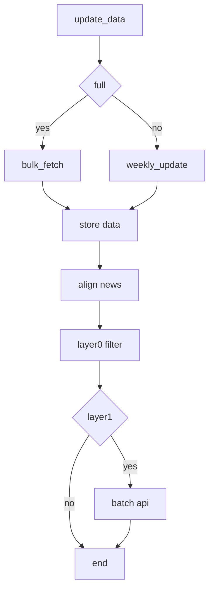
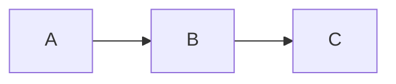

# PokieTicker 技术架构

本文档面向开发与技术评审，说明 PokieTicker 的分层架构、数据流水线、关键时序、技术栈选型与演进方向。

---

## 1. 架构目标

PokieTicker 采用“**离线更新 + 在线分析**”双轨架构：

- 离线：定时拉取市场与新闻数据，完成对齐、过滤、情绪处理
- 在线：低延迟查询与分析展示（图表、新闻、相似日、预测、区间分析）

设计目标：

1. 可解释：能回答“为什么涨跌”
2. 可持续：数据可增量更新，成本可控
3. 可扩展：从单标的扩展到多标的/策略层

---

## 2. 系统全景

---

## 3. 运行时架构（在线链路）

### 3.1 前端职责

- 标的选择、搜索、图表交互（十字线、粒子、区间拖拽）
- 新闻面板与分类筛选
- 相似交易日、相似新闻、预测、故事生成入口

### 3.2 后端职责

- 提供 REST API（stocks/news/predict/analysis/pipeline）
- 从 SQLite 读取结构化数据
- 调用本地推理与外部 AI（按需）

### 3.3 在线核心时序

---

## 4. 数据流水线（离线链路）

---

## Mermaid 预览测试

如果你看到下面这个三节点图，说明渲染器支持 Mermaid。

---

## 5. 数据模型（核心表）

- `tickers`：标的与最后拉取时间
- `ohlc`：交易日价格序列
- `news_raw` / `news_ticker`：原始新闻与标的映射
- `news_aligned`：新闻对齐交易日 + T+0/1/3/5/10 收益
- `layer0_results`：规则过滤结果
- `layer1_results`：相关性/情绪/理由
- `layer2_results`：深度分析缓存
- `batch_jobs` / `batch_request_map`：Batch 提交与回收状态

---

## 6. 技术栈与选型说明

| 层 | 技术 | 作用 | 选型理由 |
|---|---|---|---|
| 前端 | React + TypeScript | UI 组件与状态 | 生态成熟、可维护性高 |
| 前端构建 | Vite | 开发/构建 | 启动快、构建快 |
| 可视化 | D3.js + Canvas/SVG | K线与新闻粒子 | 交互自由度高，图形性能可控 |
| 后端 | FastAPI | API 服务 | 类型友好、开发效率高 |
| 数据库 | SQLite (WAL) | 本地数据存储 | 轻量、部署简单、读性能稳定 |
| 配置 | Pydantic Settings | 环境配置加载 | 类型安全、易管理 |
| 外部行情/新闻 | Polygon API | OHLC + 新闻数据 | 覆盖面广、接口稳定 |
| AI 分析 | Anthropic (Haiku/Sonnet) | Layer1/Layer2 分析 | Batch 成本可控、文本质量高 |
| 机器学习 | XGBoost | 方向预测 | 在结构化特征上表现稳定 |
| 调度 | shell + launchd | 定时更新 | 本地部署简单，运维成本低 |

---

## 7. 稳定性与成本控制

- Polygon 调用内置限速与重试（避免 429/临时失败）
- Layer0 先过滤，减少 Layer1 token 消耗
- Layer1 Batch 异步提交，回收结果落库
- Layer2 按需触发并缓存，避免重复计费
- SQLite WAL 提升并发读写稳定性

---

## 8. 当前约束与演进方向

### 当前约束

- 某些标的未训练模型时，预测接口会返回无模型结果
- AI 深度分析存在响应时间波动
- 当前鉴权与 CORS 策略偏开发友好，生产可收紧

### 演进方向

1. 模型管理与自动训练流水线
2. 行业/主题维度聚合分析
3. 多用户部署下的鉴权与权限隔离
4. 任务队列化（替代轻量 background tasks）提升可观测性

